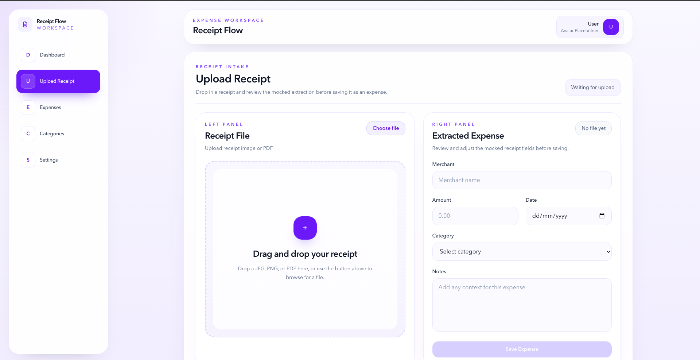
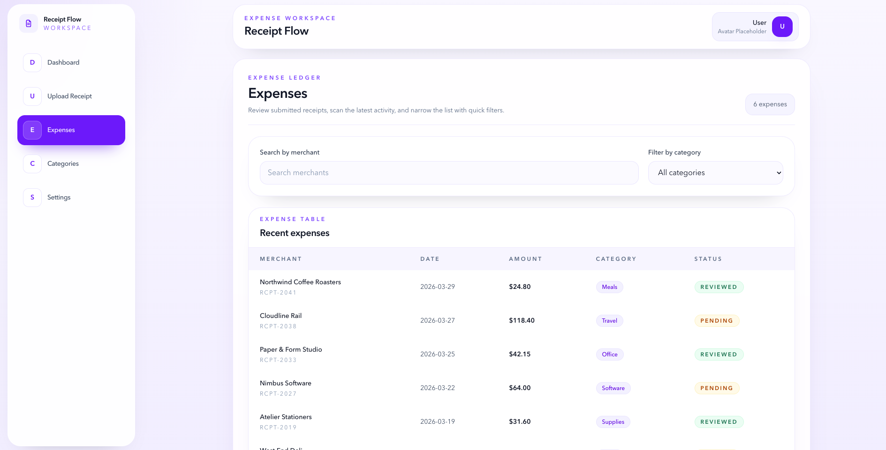

# Receipt Flow

Receipt Flow is a modern expense tracking web application designed for freelancers and small businesses.

It allows users to upload a receipt or enter expense details manually, store expenses locally, and view real-time summaries through a clean dashboard interface.

## Features

- Upload receipt images or PDFs
- Manual expense entry without requiring a file upload
- Shared expense state across pages
- Real-time dashboard summaries
- Searchable and filterable expenses table
- Local persistence using localStorage
- Clean SaaS-style responsive UI

## Tech Stack

- React
- Vite
- Tailwind CSS
- JavaScript

## How It Works

Users can create expenses in two ways:

1. Upload a receipt and review the extracted form fields
2. Enter expense details manually and save directly

Saved expenses are shown in the Expenses page and automatically update the Dashboard summary cards.

## Running Locally

```bash
npm install
npm run dev
```

## Screenshots

### Dashboard


### Upload Receipt



### Expenses


