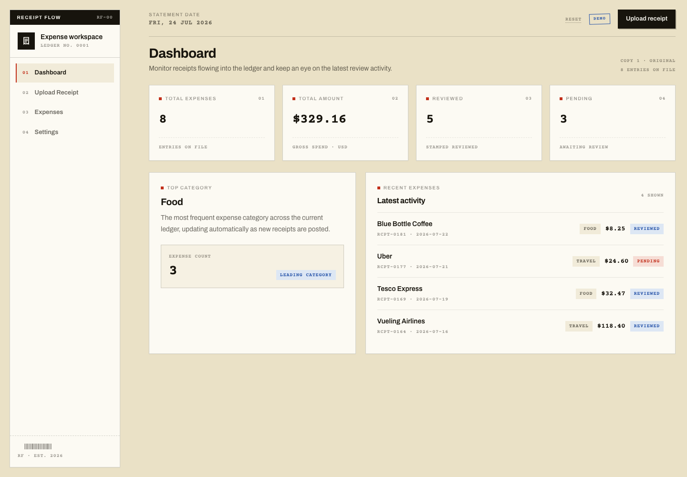
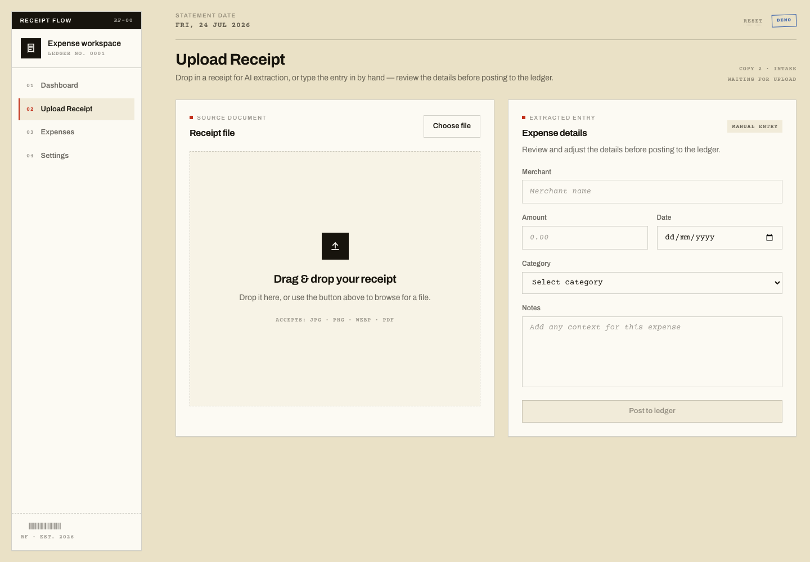

# Receipt Flow

Receipt Flow is an AI-assisted expense ledger for freelancers and small businesses.

Upload a receipt image or PDF, review the extracted entry, and post it to the ledger — or type an expense in by hand. A dashboard keeps running totals, review status, and category breakdowns up to date in real time.

**Live demo:** [receipt-flow-neon.vercel.app](https://receipt-flow-neon.vercel.app)

## Features

- AI receipt extraction (OpenAI) for images and PDFs — merchant, date, total, category, and line items
- Manual expense entry without requiring a file upload
- Sample ledger seeded on first visit, so the demo never opens empty
- Local persistence via localStorage — your uploads, edits, and voids survive a refresh
- Restore-sample-data and clear-all controls in Settings
- Searchable and filterable expense table with CSV export
- Real-time dashboard summaries and spending-by-category breakdown
- Dark mode ("after-hours ledger")

## Design

"Carbon Copy" — the app is paperwork, so the identity borrows from office forms, kept at product volume:

- Manila desk surface, white form sheets, hairline rules, zero rounded corners
- Every figure, date, and reference is typewritten (Courier Prime); UI text is Archivo in calm sentence case
- Status inks: ballpoint blue for Reviewed, stamp red for Pending and Void
- Paperwork metadata at whisper volume — form numbers (RF-01…), carbon-copy page tags (COPY 1 · ORIGINAL), a barcode, one rubber stamp for the demo mark
- Dark mode flips the form over to the carbon sheet itself

## Tech Stack

- **Frontend:** React, Vite, Tailwind CSS v4
- **Backend:** FastAPI (Python serverless function), OpenAI, pypdf
- **Hosting:** everything on Vercel — the frontend and the `/api` function deploy together from one repo

## How It Works

1. Upload a receipt (JPG, PNG, WEBP, or PDF). Large photos are downscaled in the browser first; the API extracts the text — pypdf for PDFs, the vision model for photos — and OpenAI turns it into a structured expense.
2. Review the prefilled form, adjust anything, and post it to the ledger.
3. Or skip the file entirely and enter the expense manually.

Saved expenses appear in the Expenses page and update the Dashboard automatically. In production the API is same-origin (`/api/extract-receipt`), so there is no CORS and no separate backend host to keep warm.

## Running Locally

```bash
# Frontend (Vite on 5173)
npm install
npm run dev

# API (uvicorn on 8000)
pip install -r requirements.txt
uvicorn api.index:app --reload --port 8000
```

`.env.development` points the frontend at `http://localhost:8000`. Copy `.env.example` to `.env` and set `OPENAI_API_KEY` for AI extraction (without it, PDFs fall back to regex parsing and photos return placeholder data).

## 📸 Screenshots

### Dashboard


### Upload Receipt


### Expenses & Analytics

